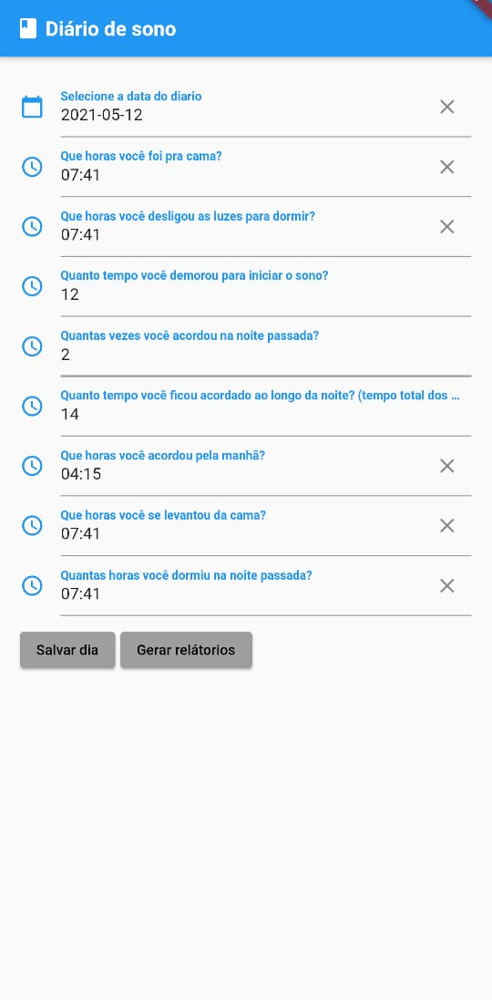
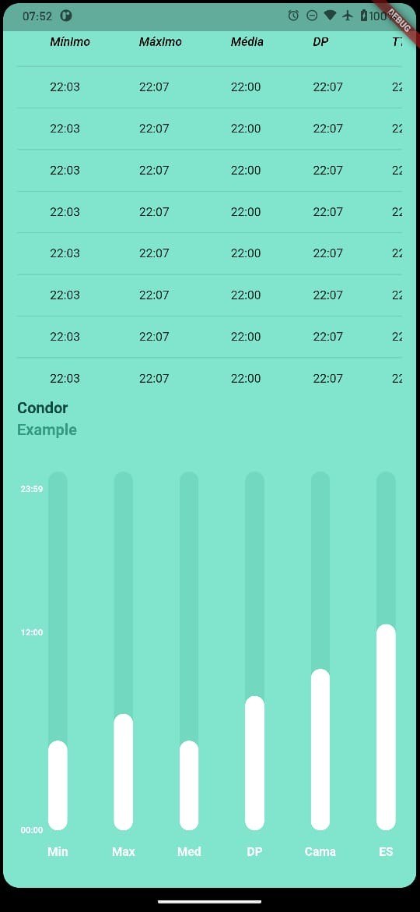
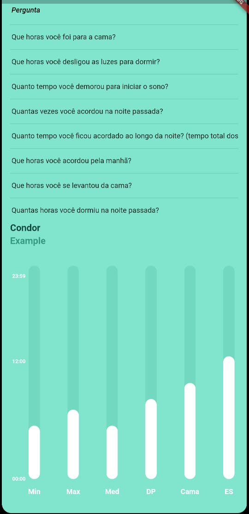

# Flutter

## Desafio:

O desafio é criar um diário de sono em uma linguagem de programação a sua escolha podendo o mesmo ser tanto um aplicativo Android, um software desktop Windows ou uma aplicação Web. A forma de entrada e visualização de dados deve ser alguma interface gráfica que não seja uma linha de comando.

## Tecnologia:

- Linguagem Dart v2.12.4
- Framework Flutter v2.0.6

## Arquitetura (padrões):

- SOLID
- Clean Code

## Como executar:

  1 - Preparar o ambiente para executar o flutter: https://flutter.dev/docs/get-started/install

  2 - Acessar a pasta raiz do projeto

  3 - Executar o comando `flutter pub get` 

  4 - Por último `flutter run` para executar o projeto

## Capturas das telas

- Tela inicial

  

- Gráfico e tabelas referentes ao diário
  
  

  

